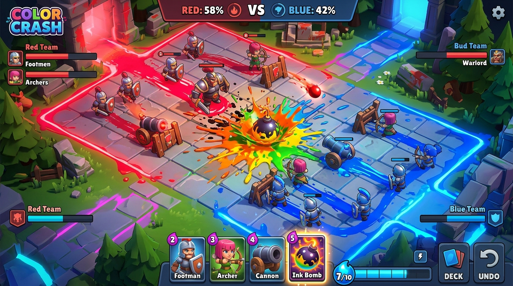

# 컬러 크러쉬: 전투 메인 기획서

---

## 목차 (Table of Contents)
- [1. 전장 개요 (Battlefield Overview)](#1-전장-개요-battlefield-overview)
  - [1.1 승리 및 패배 판정 조건 (Win / Loss Conditions)](#11-승리-및-패배-판정-조건-win--loss-conditions)
- [2. 전장 레이아웃 & 5단계 동적 규격 (Map Layout & 5 Scales)](#2-전장-레이아웃--5단계-동적-규격-map-layout--5-scales)
  - [2.1 타일 구획 및 속성](#21-타일-구획-및-속성)
  - [2.2 동적 유닛 규모(Unit Scale) 인자 연동 규격](#22-동적-유닛-규모unit-scale-인자-연동-규격)
- [3. 소환 & 배치 규칙 (Deployment Rules)](#3-소환--배치-규칙-deployment-rules)
  - [3.1 전장 크기별 건물 사용 제한 룰 (Building Rule per Scale)](#31-전장-크기별-건물-사용-제한-룰-building-rule-per-scale)
  - [3.2 건물 배치 시 유닛 밀쳐내기 (Unit Displacement)](#32-건물-배치-시-유닛-밀쳐내기-unit-displacement)
  - [3.3 월드맵 카드 해금 & 동적 손패 슬롯 시스템](#33-월드맵-카드-해금--동적-손패-슬롯-시스템-dynamic-hand-size-system)
- [4. 잉크 자원 및 유닛/전투 메카닉](#4-잉크-자원-및-유닛전투-메카닉)
  - [4.1 잉크(Ink) 자원 시스템 및 초기 잉크 룰](#41-잉크ink-자원-시스템-및-초기-잉크-룰)
  - [4.2 유닛 및 타워 상세 능력치 규격](#42-유닛-및-타워-상세-능력치-규격)
  - [4.3 유닛 물리(Physics), 시야(Aggro) 및 타겟팅 메카닉](#43-유닛-물리physics-시야aggro-및-타겟팅-메카닉)
- [5. 수비측 동선 이점 & 영역 중립화](#5-수비측-동선-이점--영역-중립화)
  - [5.1 수비측 동선 이점 (Defender's Advantage)](#51-수비측-동선-이점-defenders-advantage)
  - [5.2 건물 파괴 시 영역 중립화 (Neutralization)](#52-건물-파괴-시-영역-중립화-neutralization)
- [6. 동적 4단계 전투 진행 공식 (Dynamic 4-Phase Flow)](#6-동적-4단계-전투-진행-공식-dynamic-4-phase-flow)
- [7. 적 AI 행동 규칙 및 데이터 구조 (Enemy AI Architecture)](#7-적-ai-행동-규칙-및-데이터-구조-enemy-ai-architecture)
- [8. 실시간 전황 UI 및 가시화 (Real-Time UI Indicator)](#8-실시간-전황-ui-및-가시화-real-time-ui-indicator)
- [9. 승리 등급 판정 및 월드맵 연동 (Star Rating)](#9-승리-등급-판정-및-월드맵-연동-star-rating)

---

## 1. 전장 개요 (Battlefield Overview)


*▲ 컬러 크러쉬(Color Crash) 실시간 그리드 전투 씬 컨셉 비주얼*

Color Crash의 전장은 직사각형 형태의 그리드 타일맵으로 구성되며, "영역 점령(칠하기)"과 "전선(Frontline) 확장"을 핵심 테마로 합니다.

- 동적 5단계 전장 시스템 (Dynamic 5-Scale System): 
  - 전투 시작 시 월드맵(또는 대전 모드)에서 전달받는 인자(Parameter) 값에 따라 전장의 크기가 총 5가지 단계 중 하나로 동적 선택됩니다.
  - 전투 제한시간(Match Duration) 및 Phase 진행 시간은 결정된 전장의 크기에 비례하여 동적으로 자동 산정됩니다.

### 1.1 승리 및 패배 판정 조건 (Win / Loss Conditions)
1. **즉시 K.O 승리 (Instant Knockout Victory)**:
   - 전투 제한시간과 상관없이 전장의 **전체 타일을 100% 모두 아군 색으로 점령하는 순간 그 즉시 Perfect K.O 승리**가 선언됩니다.
2. **타임아웃 승리 커트라인 (Decision Victory)**:
   - 전투 제한시간(1분 30초 ~ 5분)이 모두 종료되었을 때, 전체 타일 중 **아군 점령 비율이 설정된 승리 커트라인(기본 70%, `BattleContext.DecisionVictoryRatio` 변수로 동적 설정) 이상일 때만 승리**로 판정됩니다.
   - 스테이지 난이도, 전투 모드(방어전, 거점정복전 등), 맵 스케일에 따라 필요 점령 비율(예: 50%~85%)을 동적으로 커스텀 설정할 수 있습니다.
3. **패배 판정 (Defeat Condition)**:
   - 제한시간 종료 시 아군 타일 점령 비율이 **설정된 승리 커트라인 미만이거나, 전투 중 아군 타일이 0개가 될 경우 패배**로 판정됩니다.

---

## 2. 전장 레이아웃 & 5단계 동적 규격 (Map Layout & 5 Scales)

월드맵 인자에 따라 선택되는 총 5단계의 전장 규격 표준입니다.

| 단계 (Scale Level) | Grid 크기 | 장애물 개수 | 추천 사용처 (월드맵 인자 예시) | 동적 제한시간 | 4단계 Phase 배분 (20% / 30% / 30% / 20%) |
| :--- | :---: | :---: | :--- | :---: | :--- |
| 1단계: 초소형 (Very Small) | 10 x 14 타일 | 1개 (중앙) | 튜토리얼 / 1v1 마이크로 듀얼 / 미니게임 | 1분 30초 (90초) | 18초 / 27초 / 27초 / 18초 |
| 2단계: 소형 (Small) | 12 x 20 타일 | 2개 (대칭) | 일반 잡몹 스테이지 / 스피드 대전 | 2분 (120초) | 24초 / 36초 / 36초 / 24초 |
| 3단계: 중형 (Medium - 표준) | 14 x 24 타일 | 2 ~ 4개 | 표준 스테이지 / 일반 대전 (기본 대표 규격) | 3분 (180초) | 36초 / 54초 / 54초 / 36초 |
| 4단계: 대형 (Large) | 20 x 28 타일 | 4 ~ 6개 | 정예 스테이지 / 라인 영토 점령전 | 4분 (240초) | 48초 / 72초 / 72초 / 48초 |
| 5단계: 초대형 (Very Large) | 24 x 36 타일 | 6 ~ 8개 | 대규모 월드 보스전 / 팀 정복전 / 이벤트전 | 5분 (300초) | 60초 / 90초 / 90초 / 60초 |

```
┌─────────────────────────────────────────┐
│     [ Red 팀 스폰 존 (15~20%) ]         │  ◄── Red 유닛 전용 스폰 구역
├─────────────────────────────────────────┤
│                                         │
│      ▒▒▒▒▒▒▒▒        ▒▒▒▒▒▒▒▒           │  ◄── 이동/점령 불가 장애물 (Obstacle)
│      (장애물 A)      (장애물 B)          │      (전장 크기에 맞춰 수/크기 스케일링)
│                                         │
│       [ 중앙 중립 타일 지대 (60~70%) ]    │  ◄── 초기 무색/회색 타일
│                                         │      (유닛이 지나가며 색칠)
│      ▒▒▒▒▒▒▒▒        ▒▒▒▒▒▒▒▒           │
│                                         │
├─────────────────────────────────────────┤
│     [ Blue 팀 스폰 존 (15~20%) ]        │  ◄── Blue 유닛 전용 스폰 구역
└─────────────────────────────────────────┘
```

### 2.1 타일 구획 및 속성
1. 스폰 존 (Base Spawn Zone):
   - 전장 최상단(Red) 및 최하단(Blue) 일부 영역.
   - 유닛 소환이 허용되는 유일한 지정 구역. 기본 해당 팀 색상으로 자동 보유.
2. 중립 타일 (Neutral Tile):
   - 전장 중앙 대부분(60~70%)을 차지하는 영역.
   - 초기에는 무색(회색). 유닛이 통과하거나 공격 명중 시 타일(HP 없음)이 해당 팀의 색상으로 점령/칠해짐.
3. 이동/점령 불가 장애물 (Obstacle Tile):
   - 전장 크기에 따라 1개 ~ 8개의 대칭형 장애물 배치.
   - 유닛 이동 및 건물 설치 불가능 ➔ 자연스러운 병목 지점(Chokepoint) 및 다중 라인(Line) 형성.

### 2.2 동적 유닛 규모(Unit Scale) 인자 연동 규격
전장 진입 시 월드맵으로부터 전장 크기 인자와 함께 **유닛 규모 인자(UnitScaleParam, N = 1 ~ 30 자연수)**를 넘겨받아 전장의 물량 밀도 및 잉크 충전 밸런스를 수식으로 자동 스케일링합니다.

1. **필드 최대 인구수 공식 (Max Unit Population Cap)**:
   - 수식: `팀당 최대 인구수 = 10 + N` (최소 11기 ~ 최대 40기)
   - N = 1 (소규모): 팀당 최대 11기 제한 (소규모 정밀전)
   - N = 15 (표준): 팀당 최대 25기 제한 (표준 대전)
   - N = 30 (대규모): 팀당 최대 40기 제한 (대규모 군단 난전)
2. **기본 잉크 충전 속도 공식 (Ink Charge Speed)**:
   - 수식: `잉크 충전 주기(초) = 1.2초 - (N x 0.02초)` (최소 1.18초 ~ 최대 0.60초)
   - N = 1: 1.18초당 1 Ink 충전 (신중한 자원 연산)
   - N = 15: 0.90초당 1 Ink 충전 (표준 속도)
   - N = 30: 0.60초당 1 Ink 충전 (폭풍 자원 수급 난전)

---

## 3. 소환 & 배치 규칙 (Deployment Rules)

카드 타입은 크게 세 가지(유닛, 건물, 마법 스펠)로 나뉩니다.

| 구분 | 유닛 (Units) | 건물 (Structures) | 마법 스펠 (Spells) |
| :--- | :--- | :--- | :--- |
| 조작 방식 | 카드 버튼 클릭 (Click) | 카드 버튼 클릭-드래그 (Drag & Drop) | 카드 버튼 클릭-드래그 (Drag & Drop) |
| 타겟/위치 | **팀별 지정 스폰 존 내부 (스폰 제한)** | 아군 점령 타일 내 어디든 자유 배치 | 전장 내 타겟 위치 어디든 즉시 시전 |
| 소환 딜레이 | 즉시 소환 (0초) | 즉시 배치 (0초) | 즉시 시전 발동 (0초) |

### 3.1 전장 크기별 건물 사용 제한 룰 (Building Rule per Scale)
전장의 크기 및 타일 구획 면적에 따라 건물 카드의 사용 여부가 동적으로 제한됩니다:
- **1~2단계 소형 전장 (유닛 스피드전)**: 
  - 좁은 타일 공간에서의 통로 막힘(Path Blocking) 방지 및 신속한 대전을 위해 **건물 카드 사용이 제한**되며 `유닛 4종 + 마법 스펠 1종` 중심의 스피드 칠하기 대전으로 자동 세팅됩니다.
- **3~5단계 중/대형 전장 (요새 공성전)**: 
  - 건물(Barricade, Cannon, Mortar)을 포함한 모든 카드가 허용되어 요새 방어선 구축 및 공성전이 진행됩니다.

### 3.2 건물 배치 시 유닛 밀쳐내기 (Unit Displacement)
- **건물 설치 타일 조건**: 건물(Barricade 4x1, Cannon 2x2, Mortar 2x2) 설치 시 배치하려는 **전체 영역(4x1, 2x2)의 모든 타일이 반드시 해당 팀(아군)의 점령 타일**이어야 합니다. 중립 타일이나 적 타일이 1칸이라도 섞여 있으면 배치가 불가능합니다.
- 아군 점령 타일 위에 건물 배치 시 유닛이 이미 올라와 있더라도 건설이 거부되지 않고 즉시 건설됩니다.
- 건물이 타일에 내려앉는 순간, 해당 타일 영역 내의 유닛들은 외곽 인접 타일로 **밀려납니다 (Push Out)**.
  - **아군 유닛**: 건물 영역 밖 가장 가까운 인접 아군 타일로 자연스럽게 밀려남.
  - **적군 유닛**: 침투한 적 유닛은 적 진영 방향으로 1칸 넉백 + 0.5초 스턴 피격 (강제 방어선 구축 효과).

### 3.3 카드 슬롯 및 동적 덱 순환 시스템 (Card Hand & Deck System)
- **상시 활성화 고정 카드 (Fixed Active Cards)**:
  - **`손패 리셋 (Ink Reroll)`** 및 **`매직 공격 (Ink Bomb 스펠)`** 2종 카드는 진입 상황에 관계없이 항상 UI 상에 **상시 활성화(Active) 상태로 고정 노출**됩니다.
- **유닛 및 건물 카드 (총 7종) 잠금/해금 및 손패 노출 룰**:
  - 대상 7종 카드 (`Footman`, `Elite`, `Warlord`, `Archer`, `Barricade`, `Cannon`, `Mortar`)는 월드맵 훈련소 건설 상태, 스테이지 파라미터에 따라 전투 진입 전 잠금(Lock) / 해금(Unlock) 상태가 결정됩니다.
  - *해금(열림) 카드가 4개 이하일 때*: 해금된 카드 전부(3~4개)가 **손패 슬롯(4슬롯 UI)에 고정 노출**됩니다.
  - *해금(열림) 카드가 5개 이상일 때*: 해금된 카드 중 **무작위(Random) 4개만 선택되어 손패 슬롯에 노출**되며 카드를 사용할 때마다 다음 카드가 순환 드로우됩니다.
- **잉크 소모 손패 리셋 (Ink Reroll)**:
  - 1 Ink를 소모하여 현재 손패를 즉시 새로고침(Reroll) 가능 (쿨타임 2초).

---

## 4. 잉크 자원 및 유닛/전투 메카닉

### 4.1 잉크(Ink) 자원 시스템 및 초기 잉크 룰
- **초기 보유 잉크 (Starting Ink)**: 
  - 전투 개시 "GO!" 카운트다운 직후 유저와 AI 모두 **기본 4 Ink를 보유한 채로 전투를 시작**합니다.
  - 0 Ink 스타트 시 발생하는 초반 정적 딜레이(Dead Time)를 제거하여, 시작과 동시에 첫 카드를 0초 만에 바로 스폰할 수 있는 경쾌한 전투 시작 템포를 제공합니다.
- **최대 보유 잉크 한도 규격 (Max Ink Capacity)**:
  - **기본 대표 한도**: 표준 전장 기본 **10 Ink** (`maxInkCap = 10`).
  - **동적 확장 룰 (Dynamic Max Cap)**:
    - *5단계 초대형 전장 (MapScale 5)*: 대규모 콤보 소환을 위해 **최대 15 Ink**로 확장.
    - *월드맵 건물 연동*: 월드맵 `잉크 저장소` 건물 건설/업그레이드 시 **최대 11~12 Ink**로 영구 확장.
    - *Phase 4 (컬러 피버)*: 충전 2배속과 함께 **최대 15 Ink**로 한도 일시 해제.
- **충전 속도 (Phase 1~3)**: 기본 설정 충전 속도 유지.
- **피버 속도 (Phase 4)**: 0.5초당 1 Ink 충전 (2배속).
- **스노우볼 방지 [분노의 잉크]**: 점령률 40% 미만 열세 팀은 잉크가 0.77초 만에 충전(30% 가속).

### 4.2 유닛 및 타워 상세 능력치 규격

| 구분 | 카드 명칭 | 소비 잉크 | Max HP | 방어력 | 이동속도 | 공격력 (ATK) | 초당 딜량 (DPS) | 사거리 (Range) | 공격 쿨타임 (속도) |
| :--- | :--- | :---: | :---: | :---: | :---: | :---: | :---: | :---: | :---: |
| **유닛** | **Footman** | 2 Ink | 120 | 5 | 35 | 25 | 31.25 DPS | 1칸 | 0.8초 (1.25 APS) |
| | **Elite** | 3 Ink | 220 | 15 | 25 | 55 | 55.00 DPS | 1칸 | 1.0초 (1.00 APS) |
| | **Warlord** | 4 Ink | 550 | 30 | 18 | 80 (건물우선, **넉백**) | 66.64 DPS | 1칸 | 1.2초 (0.83 APS) |
| | **Archer** | 3 Ink | 90 | 0 | 25 | 35 | 35.00 DPS | 5칸 | 1.0초 (1.00 APS) |
| **건물** | **Barricade** | 2 Ink | 400 (4x1) | 25 | - | - | - | 0 | - |
| | **Cannon** | 4 Ink | 300 (2x2) | 15 | - | 60 (**넉백**) | 50.00 DPS | 5칸 (직사) | 1.2초 (0.83 APS) |
| | **Mortar** | 5 Ink | 200 (2x2) | 10 | - | 75 (**광역+넉백**) | 30.00 DPS | 3~10칸 | 2.5초 (0.40 APS) |
| **마법** | **Ink Bomb** | 3 Ink | - | - | - | 50 (광역 직접 타격) | - | 3x3 타일 지정 | 즉발 (즉시 도색) |

### 4.3 유닛 물리(Physics), 시야(Aggro) 및 타겟팅 메카닉

전장의 깊이를 더하는 물리 연산 및 AI 탐색 룰입니다.

1. **시야 범위 (Aggro Range)**:
   - 유닛은 기본적으로 전방으로 직진하는 성향을 가지며, **전방 3칸 반경의 시야(Aggro Range)**를 지닙니다.
   - 이동 중 시야 반경 내에 적 유닛이나 건물이 포착되면 즉시 타겟팅을 실시하고 대상을 향해 최단 거리로 이동 궤적을 꺾어 교전을 개시합니다.
2. **유닛 충돌 크기 (Body Blocking / Collision)**:
   - 유닛들은 동일한 타일(1x1) 내에 완전히 겹쳐지지 않도록 **충돌 판정(Collision) 공간**을 지닙니다.
   - 다수의 유닛이 같은 곳으로 몰리더라도 서로를 밀어내며 자연스럽게 옆 타일로 넓게 퍼져서 이동합니다. 
3. **넉백 메카닉 (Knockback / 밀쳐내기)**:
   - 육중한 물리적 타격(Cannon/Mortar/Warlord/건물 배치 밀쳐내기)을 받을 경우 유닛은 뒤로 약 0.5칸 ~ 1칸 물리적으로 밀려나며 0.5초의 일시적인 스턴(공격 딜레이) 상태에 빠집니다.
4. **전장 경계 이탈 방지 예외 처리 (Map Boundary Clamping)**:
   - 유닛이 피격 넉백을 당하거나 건물 배치로 밀려날 때, **전장 외곽 경계선 밖으로 밀려나 탈출하거나 이동 불가 장애물(Obstacle Tile) 내부로 파묻히지 않습니다.**
   - 넉백 궤적 상 전장 경계선 타일이나 장애물 타일이 존재할 경우, 유닛의 최종 좌표는 **경계선 내부 인접 가용 타일에 정지(Boundary Clamping)** 처리됩니다.

---

## 5. 수비측 동선 이점 & 영역 중립화

### 5.1 수비측 동선 이점 (Defender's Advantage)
- 승리 팀이 적진 깊숙이 전선을 밀수록 스폰 존에서부터 전선까지 걸어오는 유닛의 이동 시간(Travel Time)이 늘어남.
- 반면 열세 팀은 스폰 존 바로 앞이 전선이므로 0초 만에 전선에 유닛 합류. 진격할수록 자연스러운 저항력(Friction) 형성.

### 5.2 건물 파괴 시 [영역 중립화 (Neutralization)]
- 적의 건물(바리케이드/캐논/박격포) 파괴 성공 시, 해당 건물이 점령하고 있던 주변 3x3 범위 타일이 즉시 '중립 타일(Neutral)'로 초기화.

---

## 6. 동적 4단계 전투 진행 공식 (Dynamic 4-Phase Flow)

전장 크기 제한시간에 따라 총 4단계로 진행되며, 전장 모드(건물 허용 맵 vs 건물 제한 맵)에 따라 부스터 특수 효과가 동적으로 적응(Adaptive)합니다.

| Phase 단계 | 명칭 및 테마 | 비율 | 건물 허용 맵 (3~5단계 중/대형) | 건물 제한 맵 (1~2단계 소형) |
| :--- | :--- | :---: | :--- | :--- |
| **Phase 1** | **영토 선점 (Opening Rush)** | **20%** | 첫 드로우 Footman 확정, Footman/Archer 이동속도 +10% | 동일 적용 |
| **Phase 2** | **전선 구축 / 수비 (Fortress Build)** | **30%** | Barricade 소모 잉크 -1 할인 (2➔1 Ink), 건물 보충 가속 | **[전선 수비 강화]** 아군 타일 위 유닛 방어력 +5, 유닛 잉크 -1 할인 |
| **Phase 3** | **요새 공성 / 돌격 (Siege & Counter)** | **30%** | Mortar/Warlord/InkBomb 가속, 건물 파괴 시 3x3 아군 도색 | **[정예 돌격 돌파]** Elite/Warlord 잉크 -1 할인, 유닛 공격력 +20% 가속 |
| **Phase 4** | **컬러 피버 (Color Fever Climax)** | **20%** | 잉크 충전 2배속 (0.5s/Ink), 카드리로드 쿨타임 0초 총력전 | 동일 적용 |

---

## 7. 적 AI 행동 규칙 및 데이터 구조 (Enemy AI Architecture)

적 AI는 세부 기획서([enemy_ai_gdd.md](file:///C:/Users/COM/.gemini\antigravity\brain\a0b831a2-4686-4e37-9b3b-e730ec02ef4b\enemy_ai_gdd.md))에 정의된 **'적 커맨더 AI (Commander AI)'**가 플레이어 역할을 수행하여 소환 카드와 타일을 실시간 결정합니다.

1. **2계층 AI 구조 (Two-Layer AI System)**:
   - **적 커맨더 AI (Commander AI)**: 잉크 관리, 손패 리롤, 유닛 스폰 위치(스폰 존 제한), 건물 벙커 구축, Ink Bomb 마법 타겟팅 결정.
   - **유닛 자율 AI (Unit AI)**: 아군/적군 공통 적용. 스폰 존 출격 후 전방 이동, 시야 반경(Aggro Range 3칸) 감지, 교전, 타일 칠하기.
2. **전장 크기 & 유닛 규모 연동**:
   - 1~5단계 MapScale 및 유닛 규모 인자(N = 1~30)에 따른 최대 인구수(`10 + N`) 한도를 감지하고 유닛/건물 소환 비중 자동 조절.
3. **ScriptableObject 기반 데이터 자산 관리**:
   - AI 수치와 성향은 `BattleAIDataSO.cs` 스크립트를 통한 `BattleAIData_XXXX.asset` 데이터 자산으로 관리하여 기획자가 유니티 인스펙터 창에서 난이도를 즉시 수정.

---

## 8. 실시간 전황 UI 및 가시화 (Real-Time UI Indicator)

- 상단 점령 비율 바 (Territory Bar): 화면 상단 중앙 실시간 컬러 비중 표시.
- 실시간 전선 표시선 (Frontline Indicator): 맵 위 최전방 전선을 형광 라인으로 표시.

---

## 9. 승리 등급 판정 및 월드맵 연동 (Star Rating)

| 승리 등급 | 판정 명칭 | 점령 달성 조건 | 보상 |
| :---: | :--- | :--- | :--- |
| **★★★ (3 Star)** | Perfect Victory | 전체 타일 100% 점령 또는 85% 이상 | 추후 기획 |
| **★★☆ (2 Star)** | Great Victory | 점령 비율 78% ~ 84% | 추후 기획 |
| **★☆☆ (1 Star)** | Clear Victory | 점령 비율 70% ~ 77% | 추후 기획 |
| **패배 (Defeat)** | Failed | 70% 미만 | - |
